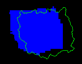

<h2> MISS-tool: medical image segmentation synthesis tool</h2>

## General Information
**`MISS-tool`** is a MATLAB-based package to emulate contours with certain segmentation errors based on a user-specified truth mask. The `MISS-tool` also provides the segmentation evaluation results of 24 segmentation performance metrics (see [Link](https://didsr.github.io/MISS-tool/Medical%20Image%20Segmentation%20Synthesis%20(MISS)%20Tool%20User%20Guide.html#_Toc184645958:~:text=A%20struct%20data%20includes%2024%20indexes%20of%20segmentation%20evaluation%20metrics) for a full list), including the Dice coefficient, Jaccard index (IoU), Medical Similarity Index (MSI), and several distance-based metrics. The tool can be used for:
* **Segmentation performance evaluation**: the user inputs a segmentation result and a reference standard (a.k.a truth) segmentation and the program outputs performance metrics chosen by the user. 
* **Image segmentation synthesis**: the user inputs a truth mask and the program outputs a segmentation contour with segmentation errors controlled by tunable parameters. The synthetic contours can be used, for example, to investigate the response of performance metrics to certain segmentation errors, thus informing the user to choose appropriate metrics for their applications [(ref)](http://dx.doi.org/10.1109/AIPR57179.2022.10092203).
  
The tool can be used in two ways: 

* **Graphical User Interface (GUI)**: the GUI allows for visualization of the synthesis results, interactively tuning synthesis parameters, and evaluation results. It includes:
  - Computing Segmentation Metrics
  - Synthesis of Segmentation Contours

* **Command-line Functions**: the command-line mode allows for processing images in batches as well as providing flexible ways for users to integrate the MISS tool with their applications. It includes:
  - Functions for segmentation evaluation metrics
  - Functions for segmentation synthesis

## Intended Purpose
The MISS tool supports multiple activities by end users and AI developers including:
 - Investigating properties of segmentation performance metrics and informing segmentation metric selection.
 - Investigating truthing methods and informing truthing method selection by allowing users to assess the impact of different augmentation methods for combining multiple segmentation (truth) masked provided by a set of truthers.
 - Assessing the robustness of a segmentation algorithm by synthesizing controlled segmentation errors on a dataset that the algorithm is intended to be applied to and investigating the variability of the performance metrics.
 - Evaluating the impact of segmentation errors on subsequent analyses through the synthesis of well controlled and customizable segmentation errors.
   The MISS-tool allows users to customize segmentation errors by configurable parameters. For example, the magnitude of contour changes, the position and height of spiculations, and the area of overlapping between the truth mask and synthetic segmentation.
   
The intended users of this MISS tool include AI segmentation algorithm developers and assessors.  The clinical use cases include AI-based segmentation applied to Digital Pathology and Radiology image datasets.


## Installation
This section will help you to install the packages needed for `MISS-tool`.


### Pre-requirements
Installed the **[MATLAB](https://www.mathworks.com/products/matlab.html) R2023b** or later versions.

### Preparation

* Download the whole repository from its GitHub and put all files as their original structure in a folder (named "MISS-tool").
```
https://github.com/didsr/MISS-tool
```

* Use GUI
  - Open the `main_option.mlapp` file with MATLAB.
  - Click the "Run" button to strat the GUI.
  
  
* Use Command-line Functions
  - Set the "Current Folder" in MATLAB as "MISS-tool"
  - Run commands in the "Command Window" in MATLAB
  - Alternatively, create "New Script" or "New Live Script" in MATLAB, and save them in the (root directory of) "MISS-tool" folder.

## User's Manual
**User's Manual: [Link](https://didsr.github.io/MISS-tool/Medical%20Image%20Segmentation%20Synthesis%20(MISS)%20Tool%20User%20Guide.html)**

### Testing Examples

* [Segmentation evaluation](https://didsr.github.io/MISS-tool/Medical%20Image%20Segmentation%20Synthesis%20(MISS)%20Tool%20User%20Guide.html#_Toc184645965)
* [Segmentation synthesis](https://didsr.github.io/MISS-tool/Medical%20Image%20Segmentation%20Synthesis%20(MISS)%20Tool%20User%20Guide.html#_Toc184645968)


## Cite this repository

If you find that `MISS-tool` is useful or if you use it in your project, please cite this code and the paper:


```
https://github.com/didsr/MISS-tool
```

```
@inproceedings{10.1117/12.2653650,
author = {Shuyue Guan and Ravi K. Samala and Arian Arab and Weijie Chen},
title = {{MISS-tool: medical image segmentation synthesis tool to emulate segmentation errors}},
volume = {12465},
booktitle = {Medical Imaging 2023: Computer-Aided Diagnosis},
editor = {Khan M. Iftekharuddin and Weijie Chen},
organization = {International Society for Optics and Photonics},
publisher = {SPIE},
pages = {1246518},
keywords = {Medical Image Segmentation Synthesis, Manual Segmentation Emulation, Segmentation Evaluation, Segmentation Errors},
year = {2023},
doi = {10.1117/12.2653650},
URL = {https://doi.org/10.1117/12.2653650}
}
```

### Auxiliary Files

The sample data are from the LIDC-IDRI dataset, grouped by slices and including fused labels using STAPLE and MV, can be found [here](https://www.kaggle.com/datasets/shuyueg/lidc-idri-byslices).

### Contact
For any questions/suggestions/collaborations regarding this tool, please contact Shuyue Guan (shuyue.guan@fda.hhs.gov) or Weijie Chen (weijie.chen@fda.hhs.gov).

## Acknowledgment 
* This project was supported in part by an appointment to the ORISE Research Participation Program at the Center for Devices and Radiological Health, U.S. Food and Drug Administration, administered by the Oak Ridge Institute for Science and Education through an interagency agreement between the U.S. Department of Energy and FDA/CDRH.

